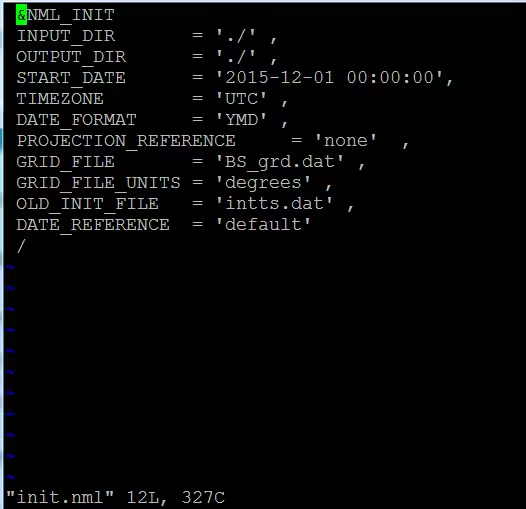
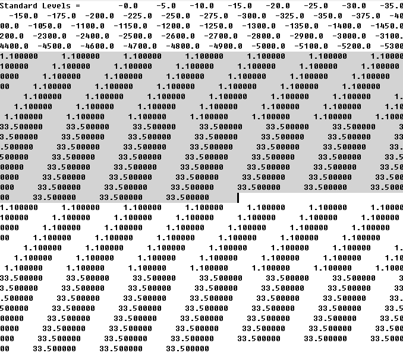
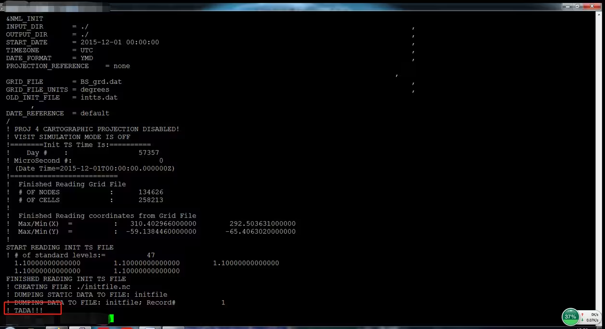
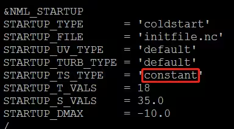
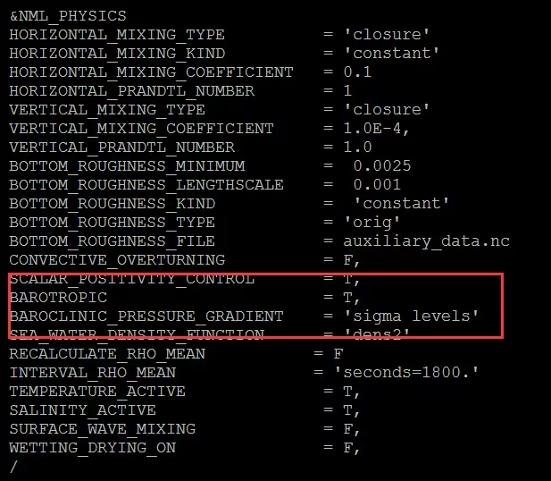

[toc]

[Reference](https://www.bilibili.com/read/cv579801/)


## make `xinit_file`

```shell
cd src/input/init_file
makke 
```

## NML file



1. 第四行是初始时间
2. 第五行是时间类型
3. 第六行是时间格式
4. 第七行是投影不用管
5. 第九行是grd.dat的节点数值意义，经纬度就是degrees，投影就是meters
6. 第十行是初始温盐场数据的dat文件


## 温盐数据dat文件



1. 第一行是标准层水深，就是每个温盐数据的水深，\
    先写一个‘Standard Levels =    ’后面给出你温盐数据的水深，\
    比如我的深度就是0m,-5m，-10m,-15m......，\
    这个水深不用严格按照相同的间隔，只要按照你的数据来就可以，\
    但是要注意的地方是水深的最深值要大于你网格的水大深度。\
    第二行是第一个经纬度点的温度，第三行是第一个经纬度点的盐度，\
    这个温度摄氏度就好，上面的图灰色区域其实就是这两行。 \
    如果某地的水深比较浅，没有达到最深层，那么不要写NaN，哪怕写9999都行，\
    但我觉得最保险的办法是重复有温度和盐度数据的最后一个深度值。\
    后面的行以此类推，都是一行温度一行盐度就行。

## Run
    
```shell
./xinit_file --filename=XXX.nml
```

## STATUS




## FVCOM



1. 将nml文件中`NML_STARTUP`中的`STARTUP_TS_TYPE`从原来的`constant`改为`observed`



2. 将nml文件中`NML_PHYSICS`中的`BAROTROPIC`从原来的`F`改为`T`, 即正压`F`改为斜压`T`
