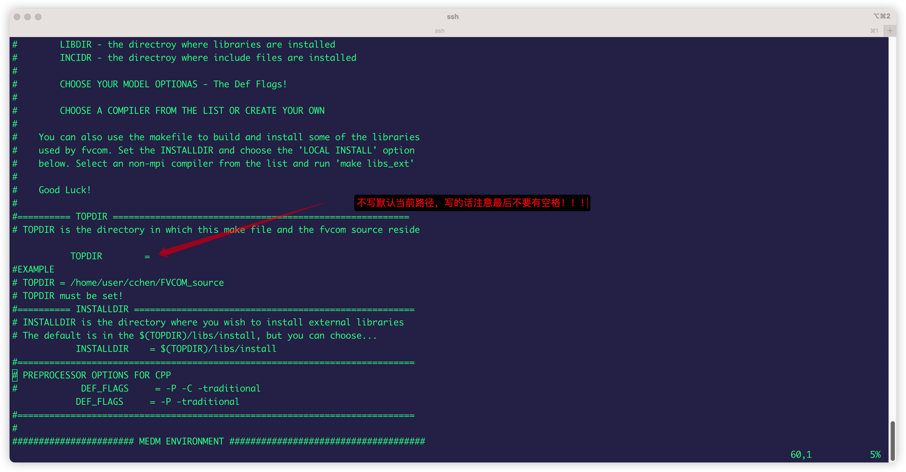
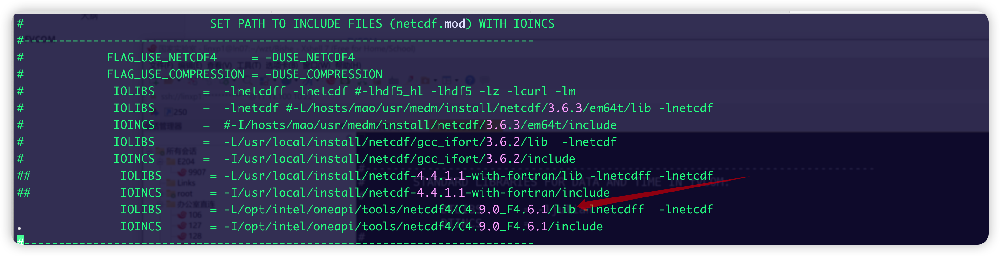

## FVCOM

### make.inc






#### PETSC

[use github issue](https://github.com/FVCOM-GitHub/FVCOM/issues/26#issuecomment-2360309926)
```makefile
#       FOR VERSION 2.0   TO 2.3.2
#            FLAG_41 = -DPETSC_A
#            include ${PETSC_DIR}/bmake/common/variables
#
#       FOR VERSION 2.3.3
#            FLAG_41 = -DPETSC_B
#            include ${PETSC_DIR}/bmake/common/variables
#
#       FOR VERSION 3.18.5
            FLAG_41 = -DPETSC_C
            include ${PETSC_DIR}/lib/petsc/conf/variables
```

[github issue](https://github.com/FVCOM-GitHub/FVCOM/issues/26#issuecomment-2361137444)
```shell
# PETSC 3.18 (GCC+MPICH)
./configure  --download-metis --download-parametis --with-fc=mpif90 --with-cc=mpicc --with-cxx=mpicxx --download-hypre --download-fblaslapack
make PETSC_DIR=$TOPDIR/libs/petsc-3.18.5 PETSC_ARCH=gcc all
make PETSC_DIR=$TOPDIR/libs/petsc-3.18.5 PETSC_ARCH=gcc check
```

[github-issue](https://github.com/FVCOM-GitHub/FVCOM/issues/26#issuecomment-2366928521)
PETSC_DEFAULT_REAL

`--with-precision=double`
