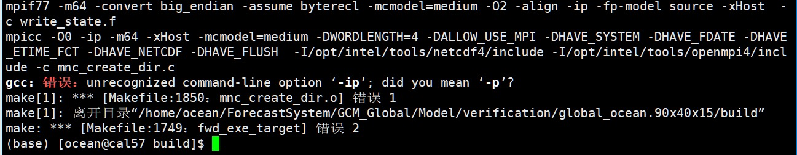
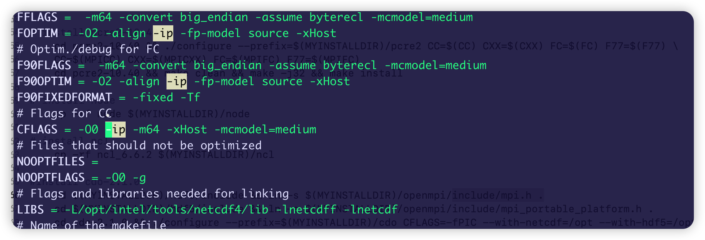
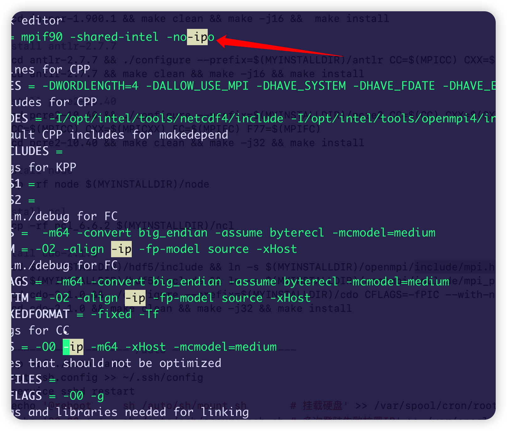
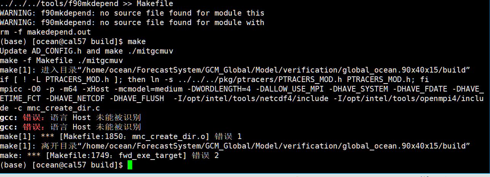
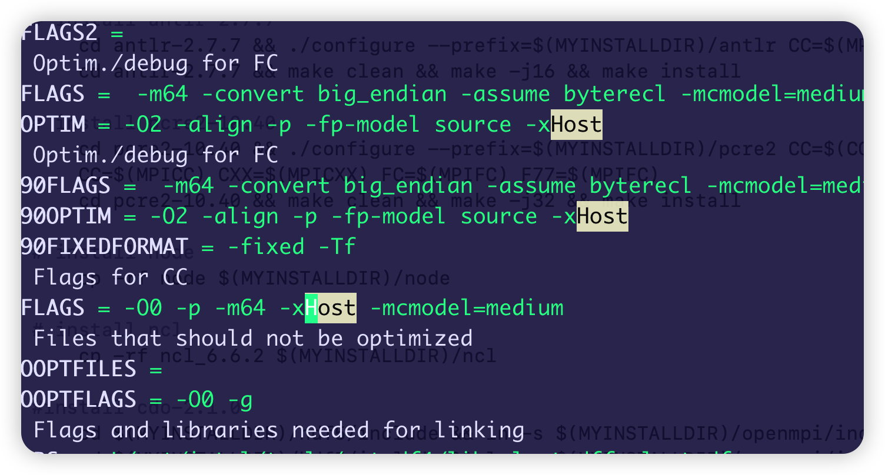

## MITgcm

### [MITgcm手册](https://mitgcm.readthedocs.io/en/latest/index.html)

### Install
> 总结下来，是ip变成p，去掉xHost

#### Issue 1





**不要改**



#### Issue 2





#### Compile

```shell
source /opt/intel/XE2018_1/compilers_and_libraries_2018/linux/bin/compilervars.sh intel64
../../../tools/genmake2 -mods ../code -mpi -of ../../../tools/build_options/linux_amd64_ifort11
make depend
make
source ~/.bash.oneapi
make -j 4
```

