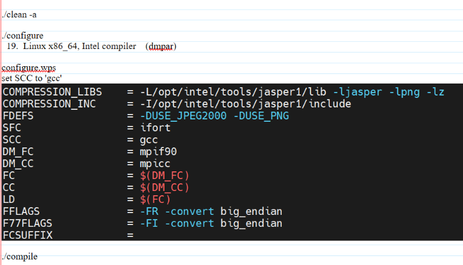

## Rocky Linux 9.1
### WRF

```shell
./clean -a
./configure 15 1 # 15 --> ifort+icc in dmpar
# extern 外部库
export J="-j 2"
./compile em_real
```

**Siqi Li（使用）**

> 更改./configure生成的 configure.wrf（57）


> 147


**Christmas**
```makefile
SFC             =       mpifort
SCC             =       mpicc
CCOMP           =       mpicc
```

### WPS



