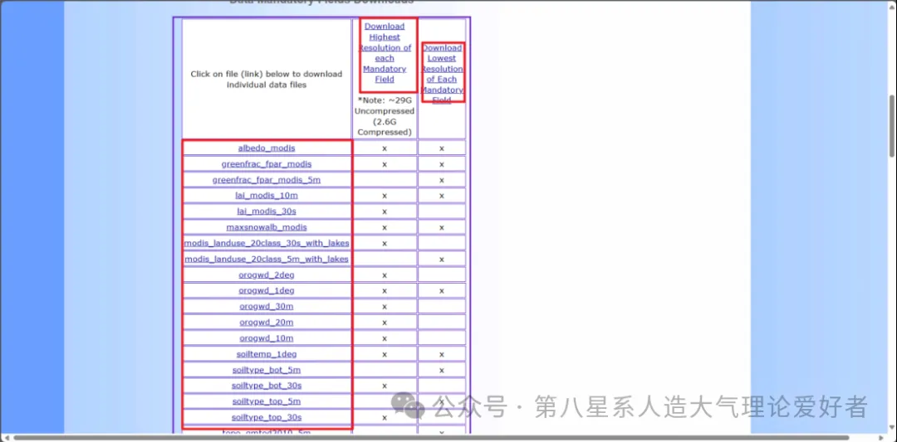

# WRF data

```shell
cd Build_WRF
mkdir DATA_GEOG
```

[Download GEOG data](https://www2.mmm.ucar.edu/wrf/users/download/get_sources_wps_geog.html)



> 此处下载的是上面两个数据，下面的数据可以按照自己的需求下载。地理数据包的种类与namelist.wps的设置有关 \
> namelist.wps位置\Build_WRF\WPS\namelist.wps


```shell
