[toc]

## 

## 简要说明

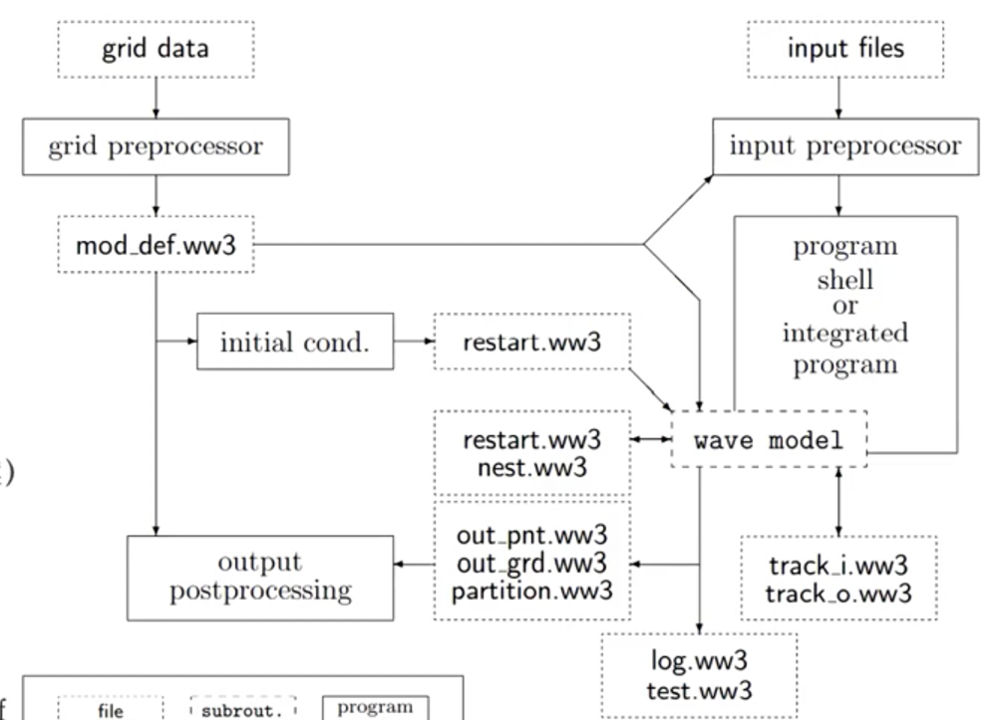

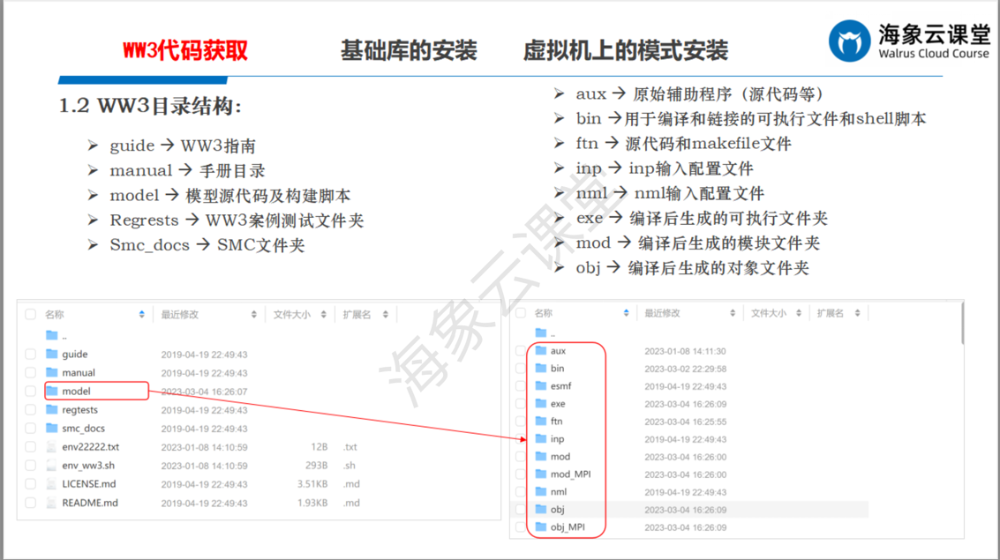

### SWITCH

- SWITCH_1

  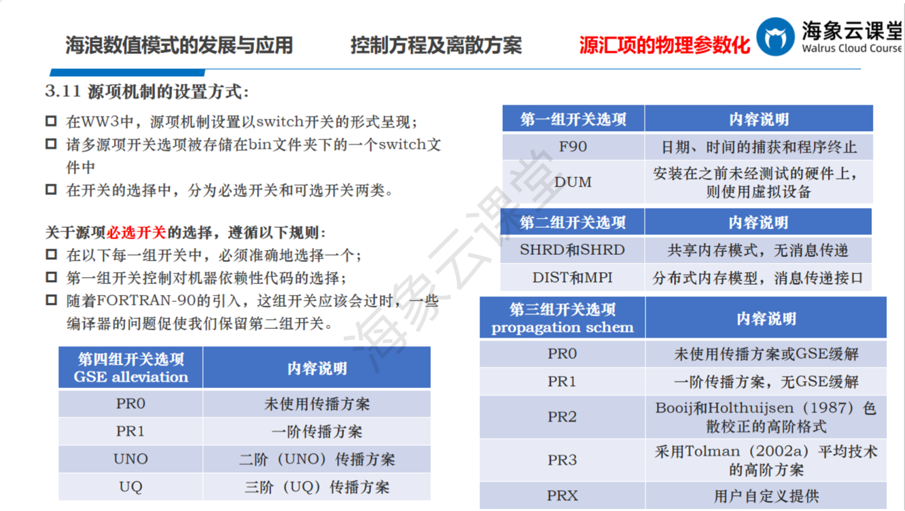
- SWITCH_2

  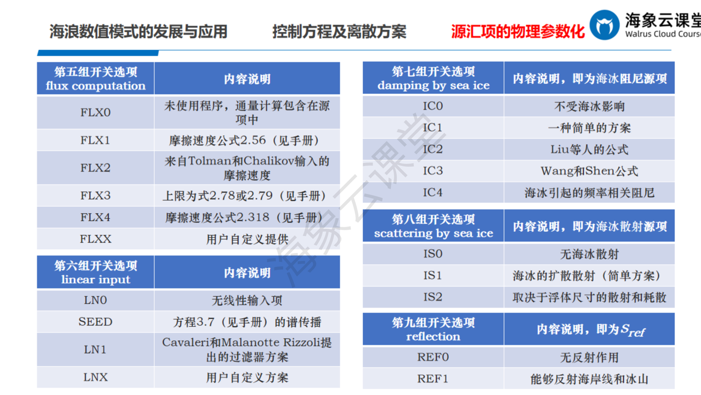
- SWITCH_3

  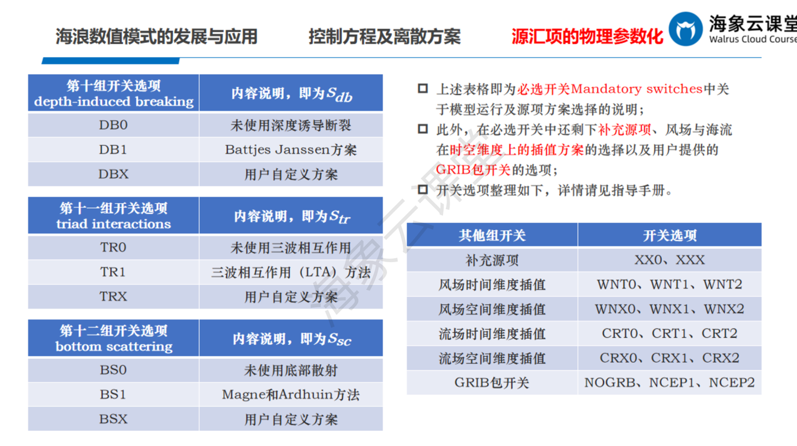

  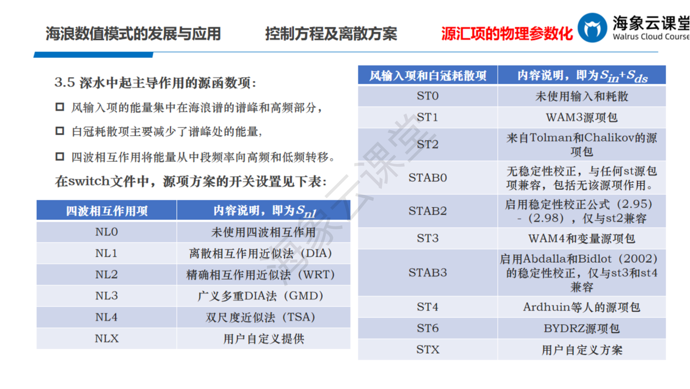

#### 海冰

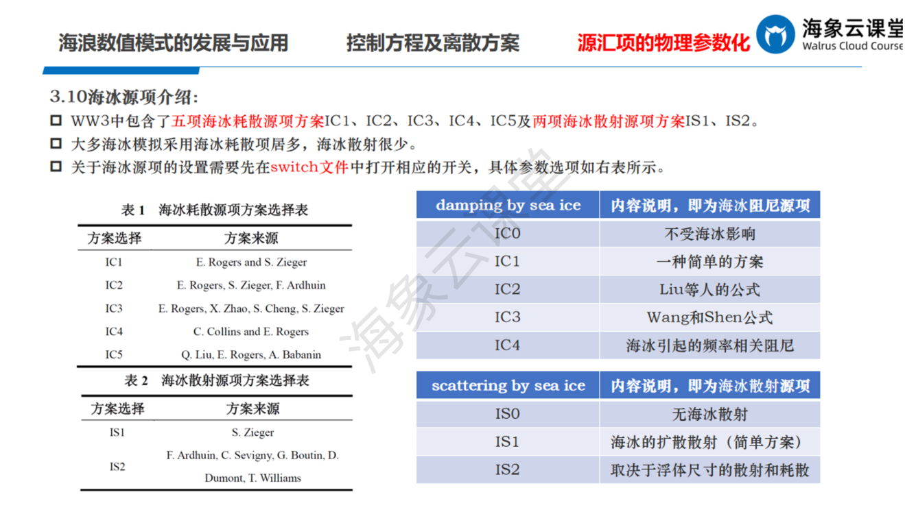<\br>

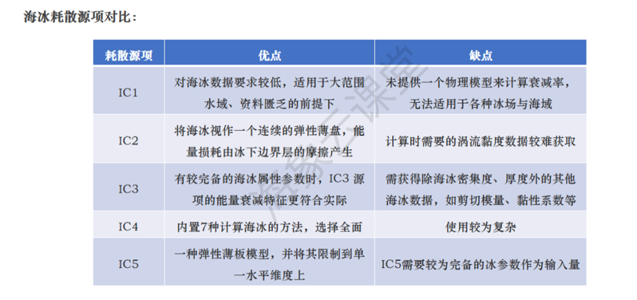<\br>

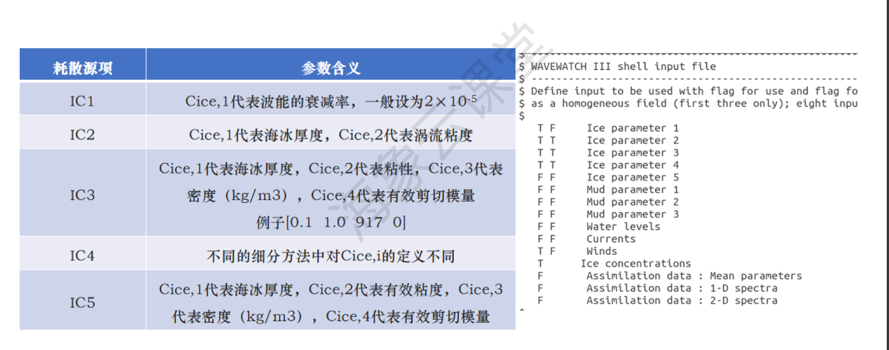<\br>

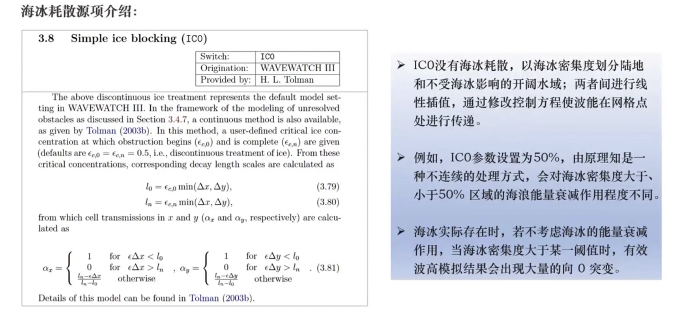<\br>

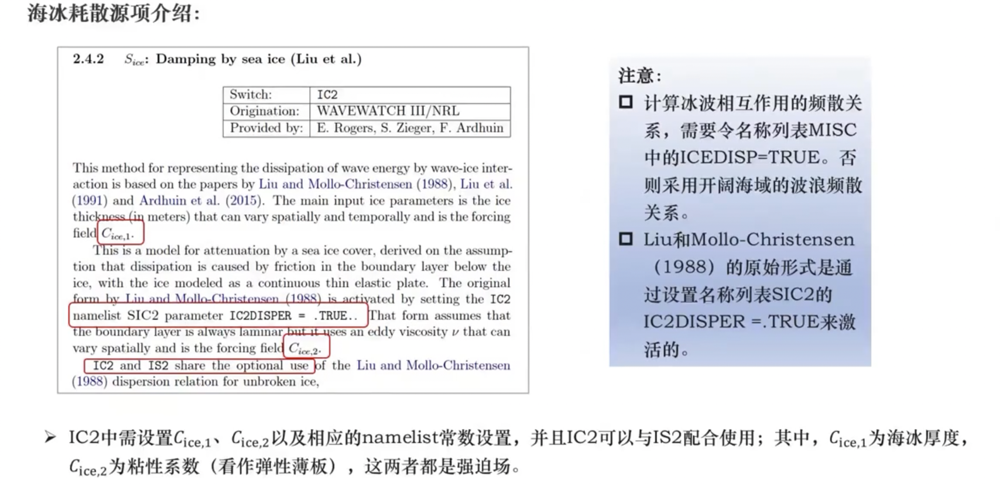<\br>

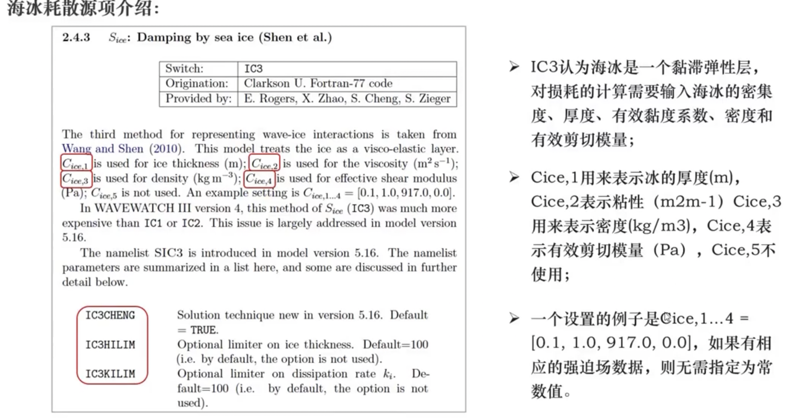<\br>

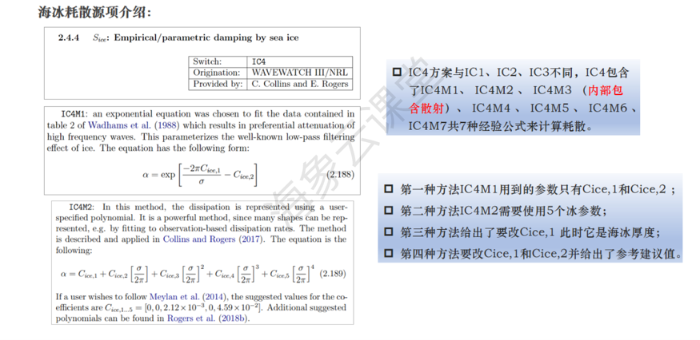<\br>

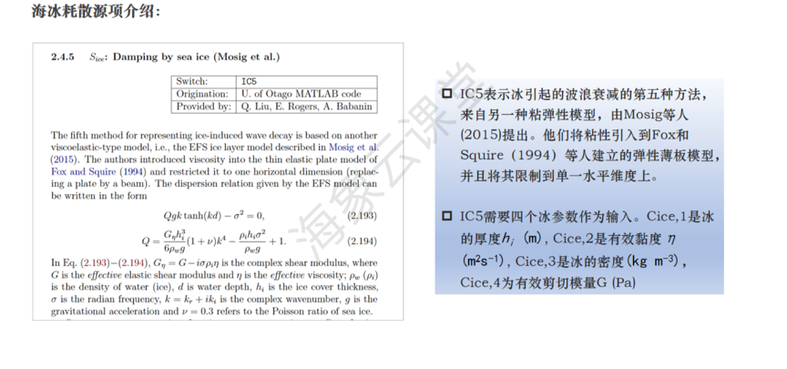<\br>

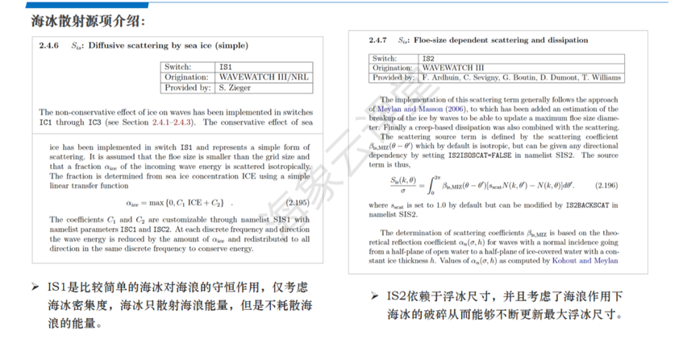<\br>

### 参数率定

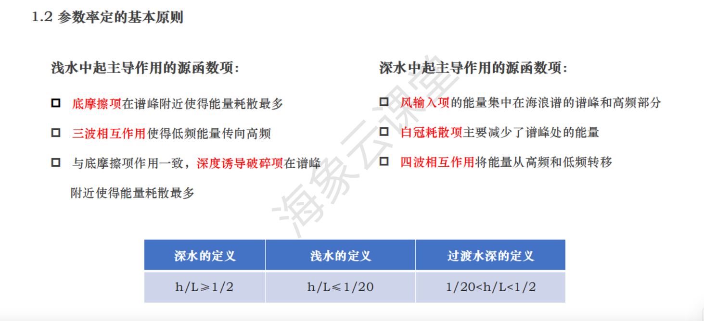<\br>

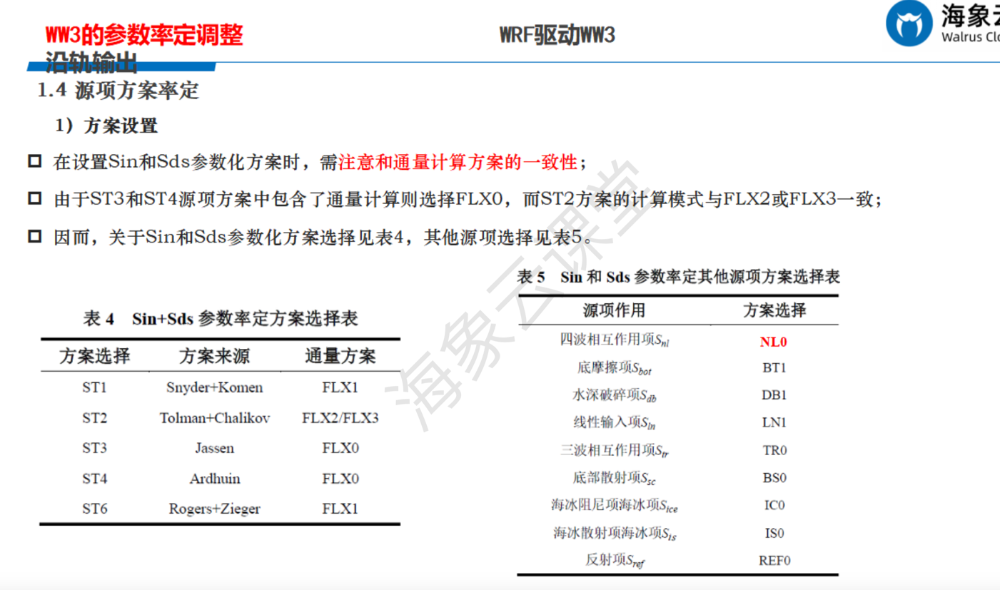<\br>

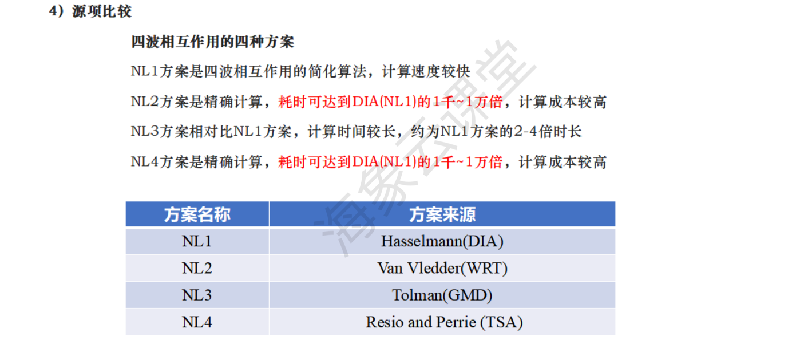<\br>

- SWITCH_BT_TR_DB
  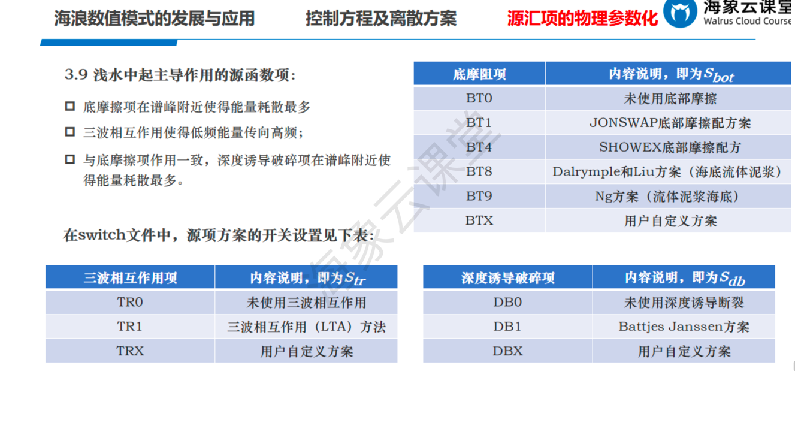

- SWITCH_On
  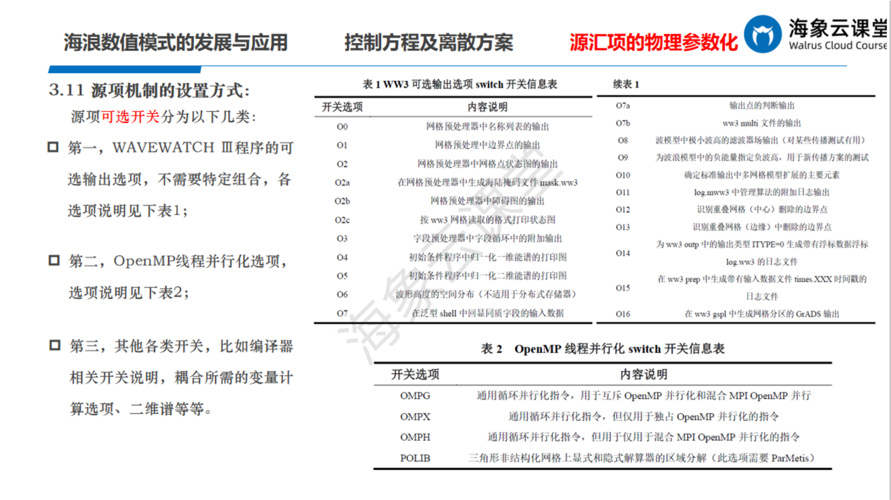

坐标系`XYG` `LLG`

**注**：
NL1最快 NL2吃资源是NL1的1000-10000倍 NL3吃资源是NL1的2-4倍（比NL1浅水较好） NL4吃资源是NL1的1000-10000倍
