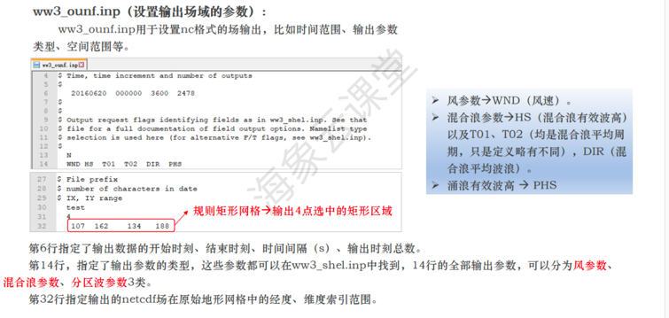

## 

### ww3_grid Example

> 文件中采用$表示注释行，即该行内容为批注，不进行读取
>
> 第二行中频率频率增长系数等所表示的意义为：模式中将海浪谱频率进行离散，
> 第一个频率设置为0.04118，之后每个频率是前一个的1.1倍，共30个频率。
> 角度数36即将一周等分为36份。
> 第一个频率的频率个数的搭配一般为 0.0418/25 和 0.0373/32
> 方向一般为24或36
> 第四行第一个全局时间步长控制模式所有分裂项进行积分得到数据的共同最小步长，
> 第二、三个为CFL步长，一般为第一个的整数分之一倍即可，
> 第四个最小源项步长用于考虑风和海浪快速变化的情况，数值越小考虑的快速变化越精确，但计算量越大，此处用于控制其最小值。
>
> FLAGTER=4为使用障碍文件
>
> 第六行网格设置，‘RECT’表示采用规则矩形网格，T表示采用经纬坐标（F为笛卡尔坐标，单位为m），
> ‘NONE’表示计算的网格不闭合（即Xn+1与X1不是同一点）。
> 4320/1921表示计算网格在x方向/y方向有4320/1921个格点，
> 0.0833表示每个格点间隔0.0833°，间隔因子1表示实际间隔为0.0833的1倍。
> 网格各点mask文件记录了网格中各点的类型，

### depth and mask Example

> （正数为陆地，负数为水深）

> （1表示海洋，0表示陆地，2表示边界）

**三角形网格信息**

### ww3_strt Example

> WW3模式中启动场通过读取restart.ww3形成，restart文件一般有两类，
> 第一类是进行第一次运算时，此时不存在热启动场，
> 则需要通过设置控制文件ww3_strt.inp以决定初始海浪场的谱形，
> 并通过运行ww3_strt产生启动场文件restart.ww3，
> 在该设置下，初始时刻风通过JONSWAP谱计算得到初始时刻有效波高猜测值，
> 并以此为第一时刻向后进行运算。当此步骤缺失时，默认从谱能量为0开始冷启动。
>
> 如果为4，则为用户自定义的谱
> 如果为5，则为从静止状态开始

> 另一类是通过读取先前运算生成的restart.ww3文件进行热启动，
> （注：热启动文件由计算及输出模块ww3_shel控制，一般命名方式为restart01, 02, 03等，
> 也可按初始场的对应日期进行命名，
> 将新的初始场文件设定为当前计算初始场时只需将相应的restart覆盖掉restart.ww3即可）。

### ww3_prep Example

> 图1中第一个红框所示部分修改为相应日期 运行ww3_prep，生成ice.ww3；

> 首先介绍ww3_prep.inp，如图所示，与网格控制文件类似，
> 第一行声明待读入的数据的类型，如WND表示读入风场，
> AI表示读入的风场与ww3_grid形成的网格文件一一对应，不需要进行插值处理，
> LL表示输入文件的经纬网格按后续设定。对于需要导入的数据的读取方式，
> （I8, I6）表示文件中时间的读取方式I8表示年月日的表示方式为8位整数，
> I6表示时分秒表示方式位6位整数，如2018年12月1日0时0分0秒，
> 则文件中该时刻的风场数据之前一行用20181201000000表示，
> 例如图所示。（1921（F7.2））表示每行中有1921个7位浮点数，小数占两个（
> 注：此处不一定要精确数字，只需大于文件中每行数据数量，程序会自动读到行末，
> 此外执行程序会先读取U分量，再读V分量，因此文件中也应先写U再写V）。

### txt_prep Example

> （txt_prep.inp文件中的内容）

### ww3_prnc Example

> ww3_prnc.inp控制文件设定与ww3_prep.inp类似

> 对于输入数据长度较小的文件，使用文本格式具备一定的优势，
> 但对于全球模型而言，其风场、海冰等文件数据长度较大，
> 采用文本文件存储对于日后查询与修改存在不变。
> 为便于存储与查询，对输入文件往往采用Netcdf格式存储。

### ww3_bounc Example

### ww3_shel Example

> 最后5行时间分别为 点输出、沿轨输出、热启动输出、单点输出、波浪追踪用到
>
> 该部分主要控制模型的计算起止时间，参数输出间隔，待输出参数选择，
> 单点二维谱输出设置，热启动输出设置等。
> 由于内容较多，再此仅对该系统所需进行说明。控制文件整体如图所示：

> 需要注意的是，该控制文件仅是将计算生成的结果按照所设置的时间间隔写入out_grd.ww3（全场）、
> out_pnt.ww3（单点二维谱）、restart.ww3（启动文件）文件中，
> 并不代表最终生成的数据，最终生成的可读取数据需调用可执行程序ww3_ounf、ww3_ounp进行输出。
> 该部分中，时间间隔设置为0即表示不加入该部分。

> 经过计算后，模型结果存放在计算结果文件out_grd.ww3文件中，
> 若需要写入nc文件中，需运行ww3_ounf，
> 其中ww3_ounf.inp文件控制输出的参数、时间间隔等。
> 在实际需求中，可能出现最终所需数据少于ww3_shel中所设或所需数据时间间隔大于ww3_shel模块中所设的情况，
> 此时只需按最终需求，对ww3_ounf.inp中内容进行设置即可。
> （注：输出初始时间及输出个数9999并非实际输出文件中的时间及个数，
> 该部分受ww3_shel.inp中参数输出时间范围的限制，若在out_grd.ww3中在该时间段内无数据，
> 则ww3_ounf无法输出数据，若有数据，则根据ww3_ounf.inp中所设参数在out_grd.ww3中选取相应数据进行输出，
> 因此为保证输出时间完整，输出个数应当尽量够大）。

### ww3_ounf Example

### ww3_ounp Example

