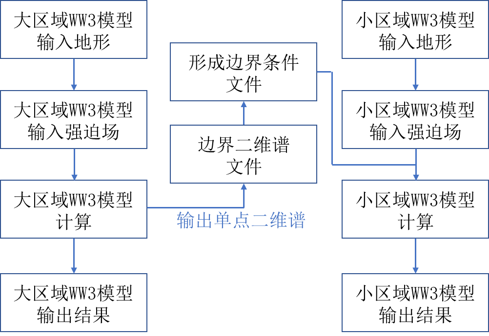

## 嵌套

### 流程图

> 网格嵌套通常是通过计算大区域粗网格，以提供小区域细网格的边界条件，再计算小网格进行。
> 在该系统中，小区域边界条件由二维海浪谱提供，
> 在大区域模型计算过程中，以小区域边界上的各个网格点为单位，输出对应点的二维谱文件，
> 具体坐标及文件名由ww3_shel.inp部分控制，计算生成out_pnt.ww3数据，
> 并通过ww3_ounp生成单点二维谱nc数据。在大区域计算完成后，运行可执行程序ww3_ounp，
> 输出小区域边界海浪二维谱，并通过在小区域任务文件夹下的ww3_bounc.inp控制文件设定二维谱文件的路径，
> 以及网格点匹配的方式（此处推荐选用线性插值，即当小区域网格点与大区域网格点不匹配时，
> 将使用线性插值方法将二维谱插值至小区域网格点上），
> 随后运行可执行程序ww3_bounc读取二维谱信息并将其设置为边界条件。

